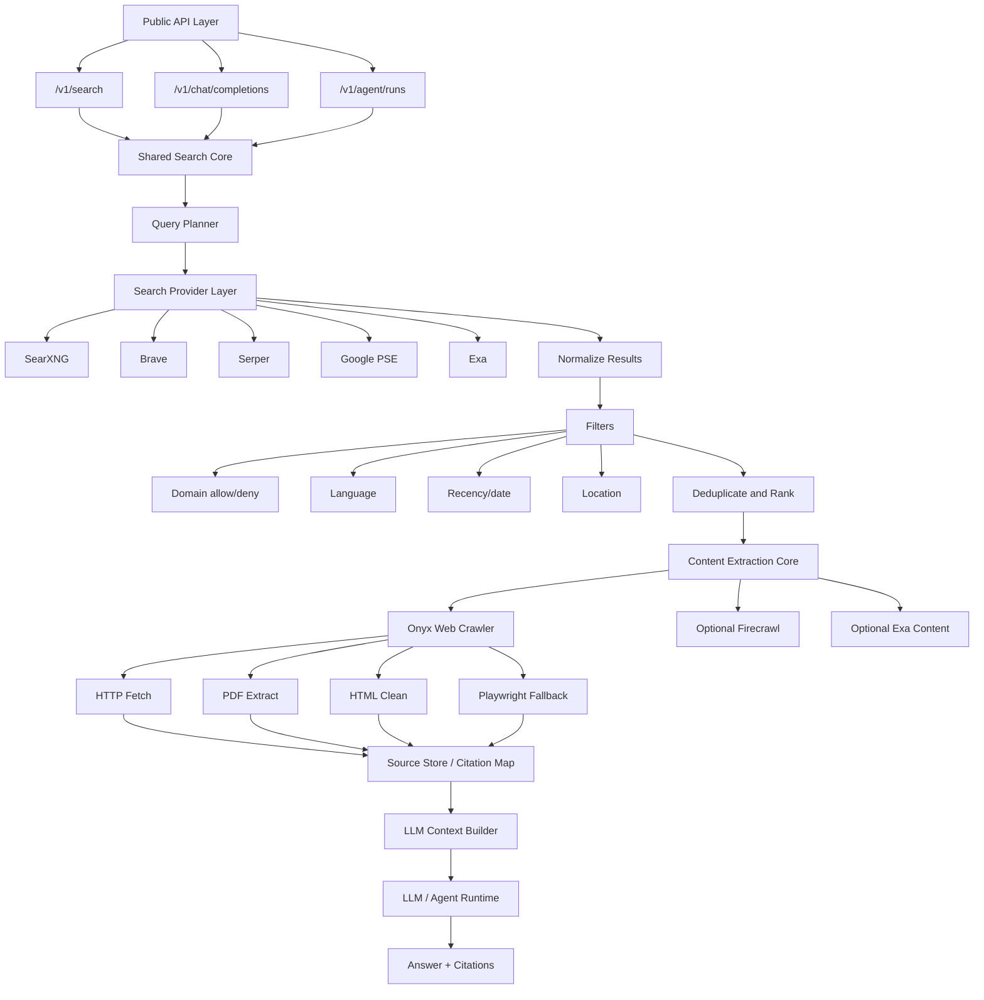

<div className="not-prose mb-10 rounded-xl border border-slate-200 bg-white p-6 shadow-sm dark:border-slate-800 dark:bg-slate-950">
  <div className="mb-4 flex flex-wrap gap-2">
    <span className="rounded-full border border-blue-200 bg-blue-50 px-3 py-1 text-xs font-medium text-blue-700 dark:border-blue-800 dark:bg-blue-950 dark:text-blue-200">guide</span>
    <span className="rounded-full border border-slate-200 bg-slate-50 px-3 py-1 text-xs font-medium text-slate-600 dark:border-slate-800 dark:bg-slate-900 dark:text-slate-300">2026-05-31</span>
    <span className="rounded-full border border-emerald-200 bg-emerald-50 px-3 py-1 text-xs font-medium text-emerald-700 dark:border-emerald-800 dark:bg-emerald-950 dark:text-emerald-200">11 min read</span>
  </div>
  <p className="m-0 text-lg leading-8 text-slate-700 dark:text-slate-300">
    Build a Perplexity-like answer flow by separating search, crawling, ranking, citation mapping, and final synthesis.
  </p>
  <div className="mt-5 flex flex-wrap gap-2">
    <span className="rounded-full bg-slate-100 px-2.5 py-1 text-xs font-medium text-slate-700 dark:bg-slate-800 dark:text-slate-200">langflow</span>
    <span className="rounded-full bg-slate-100 px-2.5 py-1 text-xs font-medium text-slate-700 dark:bg-slate-800 dark:text-slate-200">web-search</span>
    <span className="rounded-full bg-slate-100 px-2.5 py-1 text-xs font-medium text-slate-700 dark:bg-slate-800 dark:text-slate-200">onyx</span>
    <span className="rounded-full bg-slate-100 px-2.5 py-1 text-xs font-medium text-slate-700 dark:bg-slate-800 dark:text-slate-200">crawler</span>
    <span className="rounded-full bg-slate-100 px-2.5 py-1 text-xs font-medium text-slate-700 dark:bg-slate-800 dark:text-slate-200">perplexity</span>
  </div>
</div>

## Summary

This guide turns a long design conversation into a reusable architecture for building a Perplexity-like web search agent in Langflow. The core idea is to separate search recall, real-time page reading, ranking, citations, and answer generation instead of treating "web search" as one opaque box.

---

## What This Solves

The goal is to recreate the useful shape of Perplexity-style APIs without depending on Perplexity as the only backend. The resulting system can expose three API-like flows:

- **Search API:** return structured ranked web results such as title, URL, snippet, date, and last updated time.
- **Sonar-style API:** search the web, read pages, build grounded context, and return an answer with citations.
- **Agent Web Search API:** let an agent decide when to search, which URLs to open, and how to synthesize the final response while preserving a step trace.

The important constraint is that the system can reproduce the workflow and interface, but not Perplexity's private search index, ranking signals, freshness infrastructure, or proprietary quality tuning.

## Who This Is For

This is for someone building a web search flow in Langflow who wants more than a plain SearXNG or Google-style result list. It assumes you want a controllable pipeline with inspectable steps, source-grounded answers, and a crawler layer modeled after Onyx's built-in web crawler.

## Prerequisites

- A Langflow instance where you can create custom components or tool nodes.
- At least one search provider: SearXNG, Brave, Serper, Google Programmable Search Engine, Exa, or a similar API.
- A content extraction layer such as Onyx Web Crawler logic, Firecrawl, Exa content retrieval, or Playwright.
- An LLM for planning, reranking, answer generation, or all three.
- Optional but recommended: a reranker model or embeddings for relevance scoring.

## The Workflow

<Steps>
  <Step title="Split the system into three API-shaped flows">
    Treat Search API, Sonar API, and Agent Web Search as separate surfaces over the same shared search core. Search API stops at structured results. Sonar adds content extraction and answer generation. Agent Web Search adds planning, tool calls, and traceability.
  </Step>

  <Step title="Use a search provider only for URL recall">
    Search providers answer the question "which URLs might matter?" They should return normalized results with fields like title, URL, snippet, date, and last updated time. Do not make the crawler responsible for discovery.
  </Step>

  <Step title="Use an Onyx-style crawler for real-time content reading">
    The crawler answers the question "what does this URL actually say?" It should perform URL safety checks, HTTP fetching, HTML decoding, PDF extraction, HTML cleanup, and Playwright fallback for JavaScript-heavy or bot-challenge pages.
  </Step>

  <Step title="Add filters before search, not after answering">
    Filters such as domain, date, recency, language, and location should shape the search request. They can come from user settings, system defaults, or a Search Planner LLM.
  </Step>

  <Step title="Build citations as data, not as decorative links">
    Assign each retrieved page a stable source ID. Feed the LLM source-labeled context and validate that any returned citation references a real source.
  </Step>

  <Step title="Add ranking between search and reading">
    Search engines return candidate pages, not final evidence. Deduplicate results, score authority, score freshness, optionally rerank with an LLM or embedding model, then decide which URLs to open.
  </Step>
</Steps>

## Overall Architecture



## Search API

Search API returns structured results. It does not read every page deeply and does not generate the final answer.

Example request:

```json
{
  "query": "Firecrawl Exa SearXNG for Perplexity-like web search agent Langflow",
  "max_results": 5,
  "search_domain_filter": [
    "github.com",
    "docs.firecrawl.dev",
    "docs.exa.ai",
    "docs.searxng.org"
  ],
  "search_recency_filter": "year",
  "search_language_filter": ["en"]
}
```

Example response:

```json
{
  "id": "search_01",
  "provider": "searxng",
  "results": [
    {
      "title": "Firecrawl Documentation",
      "url": "https://docs.firecrawl.dev/",
      "snippet": "Scrape, crawl, map, and extract web data for AI applications.",
      "date": null,
      "last_updated": "2026-05-18"
    },
    {
      "title": "Exa API Documentation",
      "url": "https://docs.exa.ai/",
      "snippet": "Exa provides neural search and web content retrieval APIs.",
      "date": null,
      "last_updated": "2026-05-10"
    }
  ]
}
```

In Langflow, this maps to:

```text
Text Input -> Search Planner -> Search Provider -> Result Normalizer -> Filter Engine -> Deduplicator -> JSON Output
```

## Sonar-Style API

Sonar-style behavior means search plus reading plus synthesis. It returns a grounded answer and citations.

Example request:

```json
{
  "model": "local-sonar",
  "messages": [
    {
      "role": "user",
      "content": "Compare Firecrawl, Exa, and SearXNG for building a Langflow web search agent."
    }
  ],
  "max_search_results": 10,
  "search_domain_filter": [
    "docs.firecrawl.dev",
    "docs.exa.ai",
    "docs.searxng.org",
    "github.com"
  ],
  "web_search_options": {
    "search_context_size": "medium"
  }
}
```

Example response:

```json
{
  "id": "chatcmpl_01",
  "model": "local-sonar",
  "choices": [
    {
      "message": {
        "role": "assistant",
        "content": "For a Langflow Perplexity-like agent, use SearXNG for search recall, Onyx Web Crawler or Firecrawl for page reading, and Exa as an optional semantic search provider. SearXNG is best for open self-hosted recall, Firecrawl is strong for LLM-ready page extraction, and Exa is useful when semantic discovery matters."
      },
      "finish_reason": "stop"
    }
  ],
  "citations": [
    {
      "id": 1,
      "title": "SearXNG Documentation",
      "url": "https://docs.searxng.org/"
    },
    {
      "id": 2,
      "title": "Firecrawl Documentation",
      "url": "https://docs.firecrawl.dev/"
    },
    {
      "id": 3,
      "title": "Exa API Documentation",
      "url": "https://docs.exa.ai/"
    }
  ]
}
```

In Langflow, this maps to:

```text
Messages Input -> Search Planner -> Search API Flow -> URL Selector -> Onyx Crawler -> Chunk/Rerank -> Citation Builder -> LLM -> Citation Validator -> ChatCompletion Output
```

## Agent Web Search API

Agent Web Search makes search and URL opening available as tools. The agent can run multiple searches, inspect selected pages, and then produce a final answer with a step trace.

Example request:

```json
{
  "input": "Research whether Firecrawl, Exa, or SearXNG is better for a Langflow web search agent.",
  "tools": [
    {
      "type": "web_search",
      "search_domain_filter": [
        "github.com",
        "docs.firecrawl.dev",
        "docs.exa.ai",
        "docs.searxng.org"
      ],
      "max_results": 5
    },
    {
      "type": "open_url",
      "content_provider": "onyx_web_crawler"
    }
  ],
  "reasoning": {
    "max_steps": 6
  }
}
```

Example response:

```json
{
  "id": "run_01",
  "status": "completed",
  "steps": [
    {
      "type": "web_search",
      "query": "Firecrawl documentation LLM web scraping markdown",
      "result_count": 5
    },
    {
      "type": "web_search",
      "query": "Exa API neural search documentation",
      "result_count": 5
    },
    {
      "type": "open_url",
      "url": "https://docs.firecrawl.dev/",
      "scrape_successful": true
    }
  ],
  "output_text": "Use a combination rather than choosing one tool. SearXNG should provide open search recall, Firecrawl or Onyx Web Crawler should extract page content, and Exa can provide semantic search where quality matters more than self-hosting.",
  "citations": [
    {
      "id": 1,
      "url": "https://docs.firecrawl.dev/",
      "title": "Firecrawl Documentation"
    }
  ]
}
```

In Langflow, this maps to:

```text
Agent Input -> Planner LLM -> web_search Tool -> open_url Tool -> Scratchpad -> Evidence Check -> Final Answer -> Trace Output
```

## Onyx-Style Web Crawler

The Onyx crawler is best understood as a content extraction provider, not a search engine. It reads URLs returned by a search provider.

Its core behavior:

1. Validate the URL and block unsafe internal network targets.
2. Fetch HTML or PDF with browser-like headers.
3. Detect PDF using content type, URL suffix, or PDF signature.
4. Extract PDF text and metadata when needed.
5. Decode HTML with charset detection.
6. Clean HTML into readable text.
7. Use Playwright fallback when HTTP fetch hits 403 or bot-challenge signals.
8. Return a structured `WebContent` object with `scrape_successful` and `failure_reason`.

Example input:

```json
{
  "urls": [
    "https://docs.firecrawl.dev/",
    "https://docs.exa.ai/",
    "https://docs.searxng.org/"
  ],
  "content_provider": "onyx_web_crawler",
  "timeout_seconds": 15,
  "playwright_fallback": true
}
```

Example output:

```json
{
  "contents": [
    {
      "title": "Firecrawl Documentation",
      "url": "https://docs.firecrawl.dev/",
      "full_content": "Firecrawl is an API service that takes a URL, crawls it, and converts it into clean markdown...",
      "scrape_successful": true,
      "failure_reason": null
    },
    {
      "title": "",
      "url": "https://example.com/protected",
      "full_content": "",
      "scrape_successful": false,
      "failure_reason": "blocked by Cloudflare bot challenge"
    }
  ]
}
```

## Filters

Filters are search controls. They can be manually provided by the user, configured as system defaults, or generated by a Search Planner LLM.

Example:

```json
{
  "search_domain_filter": [
    "docs.firecrawl.dev",
    "docs.exa.ai",
    "docs.searxng.org",
    "-reddit.com",
    "-pinterest.com"
  ],
  "search_recency_filter": "year",
  "search_language_filter": ["en"],
  "country": "US"
}
```

Recommended priority order:

1. User overrides.
2. System policy.
3. Model-inferred filters.

This lets a user say "only search official docs" while still allowing the model to infer useful domains for named tools.

## Citations

Citations should be built from source metadata, not invented by the LLM. A simple citation system has three parts:

1. **Source map:** assign each page a stable `source_id`.
2. **LLM context:** present content as labeled sources.
3. **Validator:** reject or repair references to nonexistent sources.

Example source map:

```json
{
  "sources": [
    {
      "source_id": 1,
      "title": "Firecrawl Docs",
      "url": "https://docs.firecrawl.dev/",
      "content": "Firecrawl converts websites into LLM-ready markdown..."
    },
    {
      "source_id": 2,
      "title": "SearXNG Docs",
      "url": "https://docs.searxng.org/",
      "content": "SearXNG is a free internet metasearch engine..."
    }
  ]
}
```

Example LLM context:

```text
Source [1]
Title: Firecrawl Docs
URL: https://docs.firecrawl.dev/
Content: Firecrawl converts websites into LLM-ready markdown...

Source [2]
Title: SearXNG Docs
URL: https://docs.searxng.org/
Content: SearXNG is a free internet metasearch engine...
```

## What Can and Cannot Be Recreated

| Capability | Can Recreate? | Recommended Implementation |
| --- | --- | --- |
| Search API shape | High | Search provider + filters + normalized schema |
| Sonar-style answers | Medium-high | Search + crawler + LLM + citation builder |
| Agent Web Search | Medium-high | Planner + web_search tool + open_url tool + trace |
| Perplexity search quality | Not fully | Requires proprietary index, ranking, and feedback signals |
| Real-time page reading | High | Onyx crawler, Playwright, Firecrawl, or Exa content |
| Citations | High | Source map + citation validator |
| Domain/date/language/location filters | Partial to high | Depends on search provider support |

<Info>
The most realistic target is not a perfect Perplexity clone. It is a Perplexity-like, inspectable, self-controlled search agent whose quality can improve as you add better providers and rerankers.
</Info>

## Common Failure Modes

<Warning>
Do not make the crawler responsible for finding URLs. A crawler reads pages; a search provider discovers candidate pages. Mixing these roles makes the flow hard to debug and weakens result quality.
</Warning>

<Warning>
Do not trust LLM-generated citations without validation. The model should only cite source IDs that exist in the source map.
</Warning>

<Warning>
Do not expect Playwright to bypass every bot challenge. It can render JavaScript-heavy pages and sometimes recover from 403 responses, but Cloudflare and other anti-bot systems may still block access.
</Warning>

<Warning>
Do not treat SearXNG as equivalent to Perplexity's proprietary search quality. SearXNG is valuable for open metasearch, but ranking, freshness, and evidence selection need additional layers.
</Warning>

## Final Checklist

- [ ] Search API returns normalized `title`, `url`, `snippet`, `date`, and `last_updated` fields.
- [ ] Domain, date, recency, language, and location filters are applied before search.
- [ ] URL deduplication happens before crawling.
- [ ] The crawler returns `scrape_successful` and `failure_reason` per URL.
- [ ] HTML, PDF, and Playwright fallback paths are handled separately.
- [ ] Sources receive stable IDs before LLM answer generation.
- [ ] The final answer only cites known source IDs.
- [ ] Agent mode preserves web search and open URL step traces.

## What To Remember

The durable architecture is: search providers find URLs, the crawler reads URLs, ranking chooses evidence, citations preserve traceability, and the LLM writes the final answer. Perplexity-like behavior emerges from this pipeline; it does not come from any single node.

---

## Metadata

<div className="grid gap-4 md:grid-cols-2">
  <Card title="Quick Reference">
    **Type:** guide
    **Status:** published
    **Date:** 2026-05-31
  </Card>
  <Card title="Retrieval Tags">
    <div className="flex flex-wrap gap-2">
      <span className="rounded-full bg-slate-100 px-2.5 py-1 text-xs font-medium text-slate-700 dark:bg-slate-800 dark:text-slate-200">langflow</span>
      <span className="rounded-full bg-slate-100 px-2.5 py-1 text-xs font-medium text-slate-700 dark:bg-slate-800 dark:text-slate-200">web-search</span>
      <span className="rounded-full bg-slate-100 px-2.5 py-1 text-xs font-medium text-slate-700 dark:bg-slate-800 dark:text-slate-200">onyx</span>
      <span className="rounded-full bg-slate-100 px-2.5 py-1 text-xs font-medium text-slate-700 dark:bg-slate-800 dark:text-slate-200">crawler</span>
      <span className="rounded-full bg-slate-100 px-2.5 py-1 text-xs font-medium text-slate-700 dark:bg-slate-800 dark:text-slate-200">perplexity</span>
    </div>
    **Related:** [[Langflow]] · [[Onyx]] · [[Web Search]] · [[RAG]]
  </Card>
</div>
